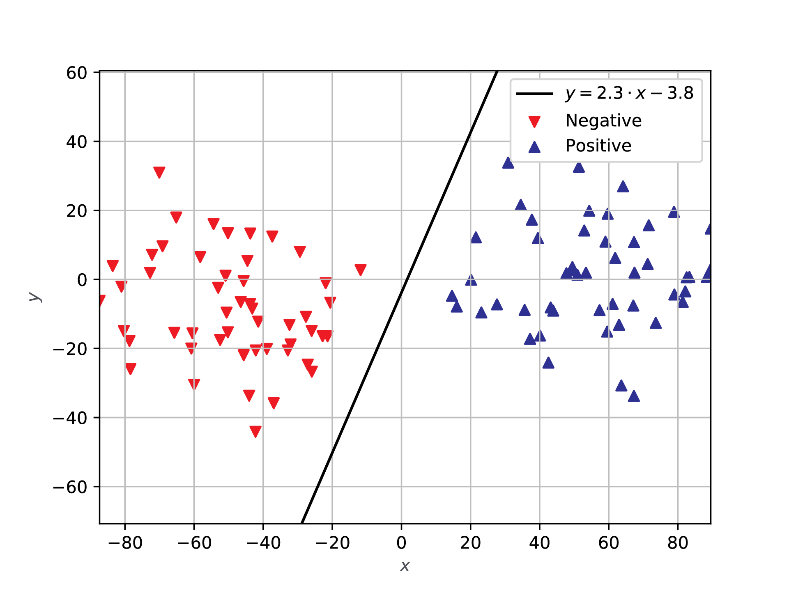
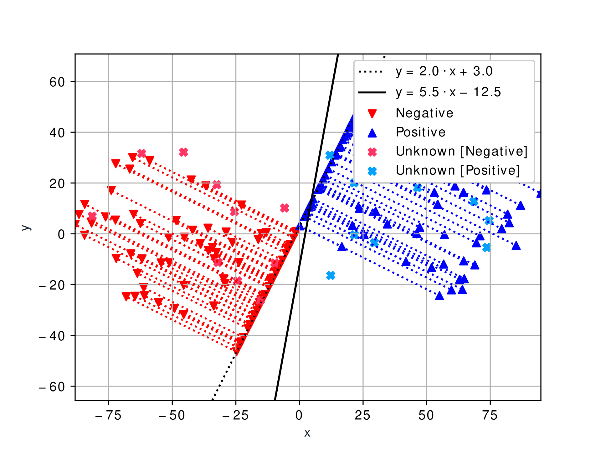

# 2D Pattern Classification via Linear Programming

## Set Up

    python -m venv env
    pip install -r requirements.txt

## Example Usage

    python classify.py -l 2 3 -g -e 20 -f ./img/example_usage

## Available Options

    usage: classify.py [-h] [-g] [-r] [-f FIGURE] [-s SEED] [-n NUMBER] [-e EXTRA]
                    [-p PERCENTAGE] [-x AXIS [AXIS ...]] [-l LINE [LINE ...]]
                    [-d DISTANCE [DISTANCE ...]] [-c CLASSES [CLASSES ...]]

    2D Pattern Classification via Linear Programming

    optional arguments:
    -h, --help            show this help message and exit
    -g, --guides          draw guides connecting each point to the separation
                            line (default: False)
    -r, --random          generate the points completely at random (default:
                            False)
    -f FIGURE, --figure FIGURE
                            save the figure as a '.eps' file with the given
                            basename (default: None)
    -s SEED, --seed SEED  initialize the internal state of the random number
                            generator (default: None)
    -n NUMBER, --number NUMBER
                            specify the number of random points that make up the
                            training set (default: 100)
    -e EXTRA, --extra EXTRA
                            specify the number of random points that make up the
                            testing set (default: 0)
    -p PERCENTAGE, --percentage PERCENTAGE
                            specify the percentage of points belonging to the
                            first class (default: 0.5)
    -x AXIS [AXIS ...], --axis AXIS [AXIS ...]
                            specify the lower and upper bounds of the horizontal
                            axis (default: [-25.0, 25.0])
    -l LINE [LINE ...], --line LINE [LINE ...]
                            specify the slope and the y-intercept of the
                            separation line (default: [2.0, -3.0])
    -d DISTANCE [DISTANCE ...], --distance DISTANCE [DISTANCE ...]
                            specify the lower and upper bounds of the distance
                            from the separation line (default: [10.0, 80.0])
    -c CLASSES [CLASSES ...], --classes CLASSES [CLASSES ...]
                            specify the classes' labels (default: ['Negative',
                            'Positive'])
